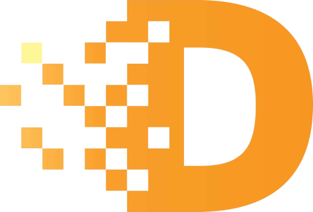

# EKOKE

Powered by **Internet Computer**

---

- [EKOKE](#ekoke)
  - [Introduction](#introduction)
    - [Project Purpose](#project-purpose)
    - [Project components](#project-components)
  - [Project structure](#project-structure)
  - [License](#license)

---

## Introduction

### Project Purpose

The project aims to facilitate the sale of a property between two or more parties, referred to in this document as A (seller) and B (buyer/s), using NFTs that serve as promissory notes.

### Project components

Deferred consists of three main canisters:

- **Deferred**: This NFT canister is used to define the sell of a real estate between two parts (the buyer and the seller).
- **EKOKE Token**: A fungible token ERC20-like, deflationary, used as an incentive to promote the buying of the NFTs and the adoption of the "Deferred method".
- **Marketplace**: A D-APP which permits to trade Deferred NFTs.

## Project structure

The project is composed by the following components:

- **deferred**: A DIP721 ICP canister which represents the Deferred NFTs.
- **Ekoke**: A ICRC-2 token ICP canister which represents the fungible token $EKOKE.
- **Marketplace**: A canister which manages the Deferred tokens sell.
- **RegisterUI**: A website for the real estate agency to register sell-contracts.
- **MarketplaceUI**: A website for the marketplace canister, where the users can buy and sell theirs Deferreds.
- **Ekoke-Swap**: A simple web canister to swap Ekoke tokens between ERC20 <> ICRC2 token

## License

You can read the entire license [HERE](LICENSE)
