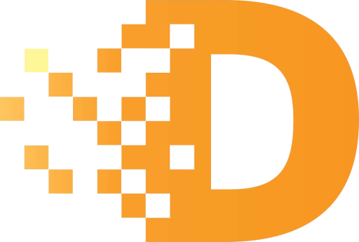

# EKOKE

Powered by **Internet Computer**

---

- [EKOKE](#ekoke)
  - [Documentation](#documentation)
  - [Get started](#get-started)
  - [Project structure](#project-structure)
  - [Changelog](#changelog)
  - [License](#license)

---

## Documentation

Read the [Project Documentation](./docs/README.md)

## Get started

...

## Project structure

The project is composed by the following components:

- **deferred**: A DIP721 ICP canister which represents the Deferred NFTs.
- **EKOKE**: A ICRC-2 token ICP canister which represents the fungible token $EKOKE.
  - **ekoke-archive**: block history for ekoke transactions
  - **ekoke-index**: Index canister for ekoke
  - **ekoke-ledger**: A ICRC-2 token ICP canister which represents the fungible token $EKOKE.
  - **ekoke-swap**: A simple web canister to swap Ekoke tokens between ERC20 <> ICRC2 token
- **marketplace**: A canister which manages the Deferred tokens sell and $EKOKE rewards giveaway.

## Changelog

Read [CHANGELOG](./CHANGELOG.md)

## License

You can read the entire license [HERE](LICENSE)
