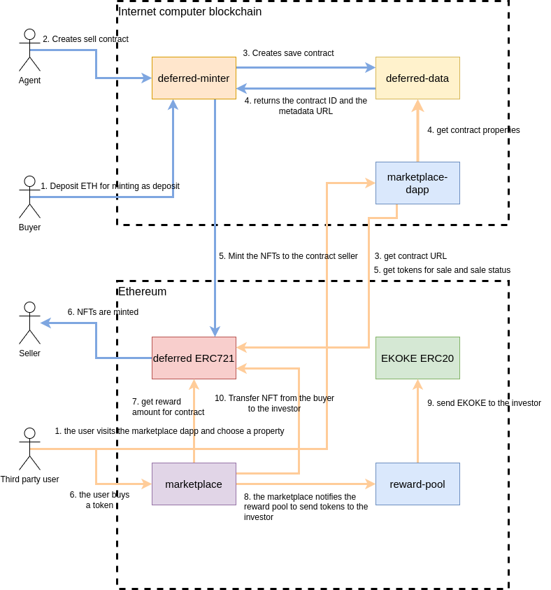

# Documentation

## Project Architecture

## Canisters

- [Deferred data](./canisters/deferred-data.md)
- [Deferred minter](./canisters/deferred-minter.md)

## Smart contracts

- [Deferred ERC721](./contracts/Deferred.md)
- [EKOKE ERC20](./contracts/Ekoke.md)
- [Marketplace](./contracts/Marketplace.md)
- [Reward Pool](./contracts/RewardPool.md)

## EKOKE rewards

- [Rewards](./reward.md)

## EKOKE DAO

- [DAO](./dao.md)
- [SNS](https://github.com/dfinity/ic/tree/master/rs/sns)
