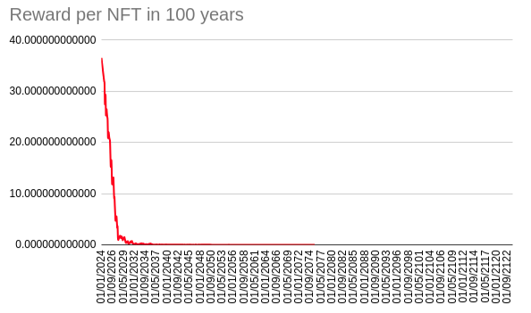

# EKOKE Reward Pool

- [EKOKE Reward Pool](#ekoke-reward-pool)
  - [Introduction](#introduction)
  - [Supply](#supply)
  - [API](#api)
    - [reserve\_pool](#reserve_pool)
    - [get\_contract\_reward](#get_contract_reward)
    - [send\_reward](#send_reward)
    - [available\_liquidity](#available_liquidity)
  - [Reward Pool](#reward-pool)
  - [Reward Deflationary Algorithm](#reward-deflationary-algorithm)
    - [Reward Multiplier Coefficient](#reward-multiplier-coefficient)
    - [Avidity](#avidity)
    - [Token Price](#token-price)
    - [Reward Analysis](#reward-analysis)
      - [Fast growhth scenario](#fast-growhth-scenario)
      - [Slow growth scenario](#slow-growth-scenario)
      - [Exponential cases](#exponential-cases)

## Introduction

The EKOKE Reward Pool canister takes care of managing the rewards for user buying Deferred NFTs on the Marketplace.

For each contract registered on Deferred a **Reward pool** is reserved and each time a user buys an NFT from the marketplace, if it's the first time that NFT is sold, the reward for the pool is sent to the user who has bought the NFT.

## Supply

At the creation of the SNS Ledger Canister for EKOKE, the following initial supply will be given to the EKOKE reward canister out of the total EKOKE Supply

**xxxxx** on **8880101.01000000** tokens

## API

The full DID can be found [HERE](../../src/ekoke_reward_pool/ekoke-reward-pool.did)

### reserve_pool

Given an ID and a certain EKOKE amount, it reserves a pool for the given contract, transferring the EKOKE amount from the caller's account to the reward pool.

Before calling this method, the caller must have given allowance to the reward-pool canister for at least `amount + ICRC_fee` .

### get_contract_reward

This method can only be called by the deferred canister and it is used to get the reward to set for a token associated to a new contract.

### send_reward

This method can only be called by the marketplace canister and it is used to send the reward after a token is sold.

### available_liquidity

Get the available liquidity in the reward pool

## Reward Pool

The reward pool can work in two different modes:

- Automatic Mode: If there is still available liquidity in the reward pool, then this mode should be preferred. Basically when a contract is created, the deferred canister will query the reward pool to check whether there is already a pool associated to that contract. If there's not a certain liquidity will be reserved as reward for token buyers following the Reward Pool Algorithm, which you can read about in the next chapter.
- Manual Mode: A user can opt to reserve a EKOKE pool using its EKOKE tokens for a contract before is created. This mode could be preferred to promote the sell of his real-estate or is mandatory in the case the liquidity pool of the reward canister is empty.

Note that once the reward pool is empty, it basically can never be refilled, unless someone deliberately sends tokens to the canister account.

## Reward Deflationary Algorithm

This algorithm is applied only on contract registered when the **Automatic Mode** is used.

Once a contract is registered on Deferred, Deferred will call the reward pool canister to collect the reward to assign for each contract's token sold.

The reward, if a pool is still not reserved for the contract will be calculated using the following formula:

```txt
reward = rewardPoolLiquidity * RMC * avidity
```


Where:

- RMC is the "reward multiplier coefficient"
- avidity is the "preservation pool coefficient"
- token value: the price of a token for the contract

The reward will never be lower than ICRC_FEE * 10 though.

### Reward Multiplier Coefficient

The RMC is a coefficient which is used to establish the reward for a contract, trough the multiplication of the pool liquidity.

The initial value of the RMC will be `0.0000042` and the value will be halved each 4 years.

Its value will never reach a value under `2e-8`.

### Avidity

In case the growth of real estate sell is too high, this could cause an early reward pool drainage. For this reason is has been implemented a further coefficient, called **Avidity**, which is multiplied to the RMC when the reward is calculated.

The avidity value follows this schema.

1. Avidity has an initial value of 1.0
2. Each month I track the amount of contracts created (**CPM**)
3. After another month I calculate **CPM2**
4. I calculate the difference between **CPM2** and **CPM1**
   1. If CPM2 is greater than CPM1, then I decrease the avidity by 0.1
   2. Otherwise I increment avidity by 0.1
5. Avidity becomes `avidity = max(0.1, min(0.1, new_avidity))`

### Token Price

TODO:

### Reward Analysis

#### Fast growhth scenario

These analysis have been done with this initial scenario

1. Time period 100 years
2. Increase per year of the growth factor 0.04%
3. Average NFT sold each month: 4.000




#### Slow growth scenario

These analysis have been done with this initial scenario

1. Time period 100 years
2. Increase per year of the growth factor 0.01%
3. Average NFT sold each month: 1.000


#### Exponential cases

We have analysed cases where an exponential growth factor could exhaust the reward pool in a few years. For example a compound growth factor in sells of the 50% could exhaust the pool in about 20 years, while with a factor of 30% in about 50 years. But if the growth factor stays under the 25% the pool could keep reserving liquidity for hundreds of years.

These cases should be anyway mitigated by the introduction of the avidity coefficient.
